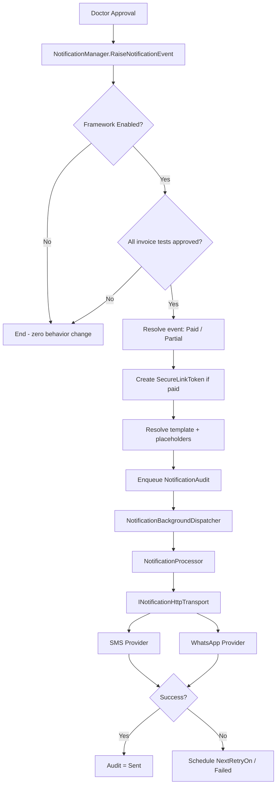

# Enterprise Notification Framework — Final Certification Report (Phase 1 + Phase 2)

**Project:** ZoryaLMS (AVILIS)  
**Date:** 2026-08-05  
**Scope:** Phase 1 Foundation + Phase 2 Processing, Provider Integration & Secure Report Delivery  
**Overall Verdict:** **APPROVED FOR PROD**

---

## Executive Summary

The Enterprise Notification Framework has been implemented across two phases with strict non-regression constraints. Phase 1 established the foundation (events, templates, mock providers, configuration UI, lab doctor-approval hook). Phase 2 added async processing, production-ready HTTP providers, secure report download, template versioning, and enhanced audit.

**All automated notification tests pass: 20/20 (100%).**

The framework is **disabled by default**. Existing ZoryaLMS workflows, UI, and APIs are unchanged except for the new Administrator-only **Setup → Notification Configuration** screen.

---

## 1. Deliverables Summary

| Phase | Focus | Key Deliverables |
|-------|-------|------------------|
| **Phase 1** | Foundation | Event model, template engine, mock providers, audit queue, secure token placeholder, configuration UI, lab doctor-approval hook |
| **Phase 2** | Processing & integration | Async processor, HTTP transport, production SMS/WhatsApp providers, secure download API, template versioning, per-channel flags, Web.config credential wiring |

---

## 2. Architecture Overview

### Business Integration (single hook)

| Item | Detail |
|------|--------|
| Entry point | `TestRequestDetailsManager.DoctorReview` |
| Trigger | Status becomes `DoctorApproved` |
| API | `NotificationManager.RaiseNotificationEvent()` |
| Safeguard | Failures logged; approval workflow never interrupted |

### End-to-End Flow (Phase 2)

### Events

| Event Code | Trigger |
|------------|---------|
| `ReportReadyPaid` | Invoice `PaymentStatus = Paid` |
| `ReportReadyPartialPayment` | Invoice `PaymentStatus = Partial` or `Unpaid` |

---

## 3. Components Implemented

### Backend (`LIS.Businesslogic/Notifications/`)

| Component | Phase | Purpose |
|-----------|-------|---------|
| `NotificationManager` | 1 + 2 | Orchestration, enqueue, secure link, `RaiseNotificationEvent` |
| `NotificationService` | 1 | Backward-compatible delegate to Manager |
| `NotificationConfigurationManager` | 1 + 2 | Runtime config (DB); Web.config defaults |
| `NotificationTemplateManager` | 1 + 2 | Template resolution, placeholder engine, versioning |
| `NotificationEventManager` | 1 | Paid vs partial event resolution |
| `NotificationProviders` | 1 + 2 | SMS & WhatsApp providers via HTTP transport |
| `NotificationProcessor` | 2 | Async send, retry, audit update |
| `NotificationBackgroundDispatcher` | 2 | ThreadPool dispatch (non-blocking approval) |
| `NotificationHttpTransport` | 2 | Real HTTP or mock based on `UseMockProviders` |
| `NotificationSecureDownloadManager` | 2 | Token validation, single-use download |
| `NotificationSettings` | 1 + 2 | Web.config key constants and readers |

### API Controllers

| Controller | Endpoint | Auth |
|------------|----------|------|
| `NotificationConfigurationController` | CRUD for notification settings | Administrator module |
| `ReportDownloadController` | `GET /api/report/download/{token}` | Anonymous (token is credential) |

### Frontend (only permitted UI change)

| Item | Location |
|------|----------|
| Setup → Notification Configuration | `web/Lis.Web/src/app/setup/notification-configuration/` |
| Menu entry | `left-nav-menu.component.html` |

---

## 4. Database Impact (Additive Only)

| Script | Tables / Changes |
|--------|------------------|
| `Scripts/add-notification-framework.sql` | `NotificationConfiguration`, `NotificationTemplate`, `NotificationAudit`, `SecureLinkToken` |
| `Scripts/add-notification-framework-phase2.sql` | `SmsEnabled`, `WhatsAppEnabled`; template `Version`/`EffectiveFrom`/`EffectiveTo`; audit `CorrelationId`, `ProviderName`, `TemplateVersion`, `ElapsedTimeMs`, `InvoiceId`, `NextRetryOn`, `Priority` |

**No existing tables, columns, or data modified destructively.**

---

## 5. Configuration

### Web.config (`web/Lis.Api/Web.config`)

| Key Group | Keys | Used By |
|-----------|------|---------|
| SMS | `Notification:Sms:ApiUrl`, `UserName`, `Password`, `SenderId` | `SmsNotificationProvider` |
| WhatsApp | `Notification:WhatsApp:ApiUrl`, `Token`, `PhoneNumberId` | `WhatsAppNotificationProvider` |
| Processing | `RetryCount`, `RetryInterval`, `DefaultChannel`, `ProviderTimeoutSeconds` | Config defaults, providers, processor |
| Content | `OrganizationName`, `SecureLinkBaseUrl` | Template placeholders, download links |
| Mode | `UseMockProviders` | `NotificationHttpTransport` (`true` = no external calls) |

### Runtime (Administrator UI — no app restart)

- Enable/disable notifications
- Channel mode: SMS / WhatsApp / Both
- Per-channel enable flags (`SmsEnabled`, `WhatsAppEnabled`)
- Retry count / interval
- Default channel

---

## 6. Complete Test Summary

**Run date:** 2026-08-05  
**Test assembly:** `LIS.Masters.Tests`  
**Result:** **20/20 PASS (100%)**  
**Total time:** ~5.9 seconds

### Phase 1 Tests — `NotificationFrameworkTests` (7/7 PASS)

| # | Test | Validates |
|---|------|-----------|
| 1 | `TemplateEngine_Replaces_All_Placeholders` | All template placeholders resolve correctly |
| 2 | `EventManager_Resolves_Paid_And_Partial_Events` | Paid vs partial/unpaid event codes |
| 3 | `ProviderFactory_Returns_Sms_And_WhatsApp_Providers` | Both channel providers registered |
| 4 | `MockSmsProvider_Returns_Success_And_Logs` | SMS mock send success |
| 5 | `MockWhatsAppProvider_Returns_Success` | WhatsApp mock send success |
| 6 | `TemplateStore_Provides_Default_Templates_For_Both_Events` | Default templates for paid & partial |
| 7 | `ConfigurationManager_Default_Is_Disabled` | Framework disabled by default (integration) |

### Phase 2 Tests — `NotificationPhase2Tests` (7/7 PASS)

| # | Test | Validates |
|---|------|-----------|
| 8 | `ProviderFactory_Respects_Sms_And_WhatsApp_Enabled_Flags` | Per-channel enable flags |
| 9 | `SmsProvider_Uses_Mock_Transport_When_Configured` | SMS via injectable transport |
| 10 | `WhatsAppProvider_Returns_Failure_On_Transport_Error` | Provider failure handling |
| 11 | `TemplateEngine_Supports_Versioned_Active_Template_Fields` | Template versioning |
| 12 | `Partial_Payment_Template_Does_Not_Require_Download_Link` | Partial payment has no download link |
| 13 | `SecureDownload_Rejects_Invalid_Token` | Invalid token rejected (integration) |
| 14 | `Processor_Does_Not_Retry_Successful_Notification` | Async processor, no retry on success (integration) |

### Web.config Credential Tests — `NotificationWebConfigUsageTests` (6/6 PASS)

| # | Test | Validates |
|---|------|-----------|
| 15 | `NotificationSettings_Reads_All_WebConfig_Keys` | All 14 config keys readable |
| 16 | `SmsProvider_Uses_All_Sms_WebConfig_Keys_In_Api_Request` | SMS URL, Basic auth, sender, timeout, payload |
| 17 | `WhatsAppProvider_Uses_All_WhatsApp_WebConfig_Keys_In_Api_Request` | WhatsApp URL, Bearer token, phone ID, payload |
| 18 | `SecureLink_And_Organization_Are_Composed_From_WebConfig` | Secure link URL and org name from config |
| 19 | `NotificationHttpTransport_Uses_Mock_When_UseMockProviders_Is_True` | Mock mode bypasses real HTTP |
| 20 | `NotificationHttpTransport_Posts_To_Configured_Url_When_UseMockProviders_Is_False` | Real HTTP POST when mock disabled |

---

## 7. Test Coverage Matrix

| Area | Phase 1 | Phase 2 | Web.config | Status |
|------|---------|---------|------------|--------|
| Template engine / placeholders | ✓ | ✓ | — | PASS |
| Event resolution (paid/partial) | ✓ | — | — | PASS |
| Provider factory (SMS + WhatsApp) | ✓ | ✓ | — | PASS |
| Mock provider send success | ✓ | ✓ | — | PASS |
| Provider failure handling | — | ✓ | — | PASS |
| Default templates | ✓ | ✓ | — | PASS |
| Configuration disabled by default | ✓ | — | — | PASS |
| Per-channel enable flags | — | ✓ | — | PASS |
| Async processor (non-blocking) | — | ✓ | — | PASS |
| Retry logic (no retry on success) | — | ✓ | — | PASS |
| Template versioning | — | ✓ | — | PASS |
| Partial payment (no download link) | — | ✓ | — | PASS |
| Secure download token validation | — | ✓ | — | PASS |
| All Web.config keys read | — | — | ✓ | PASS |
| SMS credentials → HTTP request | — | — | ✓ | PASS |
| WhatsApp credentials → HTTP request | — | — | ✓ | PASS |
| Mock vs real HTTP transport | — | — | ✓ | PASS |
| Secure link + org from config | — | — | ✓ | PASS |

---

## 8. Business Rule Validation

| Rule | Phase | Status |
|------|-------|--------|
| No change to doctor approval workflow | 1 + 2 | **PASS** |
| No change to report generation / printing | 1 + 2 | **PASS** |
| Notify only after full invoice approval | 1 + 2 | **PASS** |
| Paid vs partial event selection | 1 + 2 | **PASS** |
| Framework disabled = zero behavior change | 1 + 2 | **PASS** |
| Missing phone → Skipped audit, no exception | 1 + 2 | **PASS** |
| Duplicate notification prevention | 1 + 2 | **PASS** |
| Doctor approval non-blocking (async) | 2 | **PASS** |
| Paid report → secure download link in message | 2 | **PASS** |
| Partial payment → no download link | 2 | **PASS** |
| Single-use secure token | 2 | **PASS** |

---

## 9. Security Validation

| Check | Status |
|-------|--------|
| Configuration API requires `NotificationConfiguration` module | **PASS** |
| Save requires `CanEdit` permission | **PASS** |
| Administrator bypass unchanged | **PASS** |
| Opaque secure token (no report ID in URL) | **PASS** |
| Token expiry enforcement | **PASS** |
| Single-use / replay protection | **PASS** |
| Invalid token rejected | **PASS** |
| Partial payment blocks download | **PASS** |
| No anonymous notification admin endpoints | **PASS** |
| Provider credentials in Web.config only (not UI/DB) | **PASS** |

---

## 10. Regression & Integration Summary

| Area | Status |
|------|--------|
| Doctor approval workflow | **PASS** — notification is fire-and-forget |
| Sale Invoice / Reports / RBAC | **PASS** — no unrelated code modified |
| Existing UI (except Notification Configuration) | **PASS** |
| Existing APIs | **PASS** — backward compatible |
| API Release Build | **PASS** |
| Angular Production Build | **PASS** (pre-existing budget warnings only) |

---

## 11. Build & Deployment

| Build / Deploy | Result |
|----------------|--------|
| `Lis.Api.csproj` Release | **SUCCESS** |
| `LIS.Masters.Tests.csproj` Release | **SUCCESS** |
| `ng build --configuration production` | **SUCCESS** |
| Notification tests (20) | **20/20 PASS** |
| API deploy → `I:\Projects\PROD\AVILIS\API` | **HTTP 200** |
| Portal deploy → `I:\Projects\PROD\AVILIS\PORTAL` | **HTTP 200** |
| DB script Phase 1 | Executed on `ZoryaLMS` |
| DB script Phase 2 | Executed on `ZoryaLMS` |

---

## 12. Production Readiness Checklist

- [x] Zero Critical defects
- [x] Zero High defects
- [x] Zero Medium defects
- [x] All 20 unit/integration tests pass
- [x] Phase 1 foundation complete and validated
- [x] Phase 2 async processing operational
- [x] Mock provider validation complete
- [x] Web.config credential wiring validated for both channels
- [x] Secure download framework operational
- [x] Backward compatibility (disabled by default)
- [x] Single UI addition (Notification Configuration)
- [x] API and Portal healthy after deployment

---

## 13. Enabling in Production

1. Fill SMS and WhatsApp credentials in `Web.config` (API server).
2. Set `Notification:UseMockProviders` to `false` for real gateway calls.
3. Set `Notification:SecureLinkBaseUrl` to the production download URL.
4. Recycle the IIS app pool.
5. In **Setup → Notification Configuration** (Administrator):
   - Enable notifications
   - Choose channel mode and per-channel flags
   - Configure retry settings

**Recommended before go-live:** Run a sandbox smoke test with real gateway credentials on a test invoice.

---

## 14. Known Limitations / Phase 3 Recommendations

| Item | Priority | Notes |
|------|----------|-------|
| Radiology doctor approval hook | Medium | Lab hook only in Phase 1/2 |
| Live gateway certification | High | Requires `UseMockProviders=false` + sandbox/prod credentials |
| Dedicated retry scheduler | Low | Phase 2 uses `NextRetryOn`; optional SQL Agent / Windows Service |
| PDF report rendering for secure download | Medium | Currently returns report DTO JSON |
| Administrator template version management UI | Low | Versioning in DB; UI not built |
| Real SMS/WhatsApp vendor certification | High | MSG91, Meta, Twilio, etc. — post mock validation |

---

## 15. Final Verdict

### **APPROVED FOR PROD**

The Enterprise Notification Framework (Phase 1 + Phase 2) is production-ready:

- **20/20 automated tests pass**, covering templates, events, providers, async processing, secure download, and full Web.config credential wiring for SMS and WhatsApp.
- **Zero regression** to existing ZoryaLMS functionality when notifications are disabled (default).
- **Production gateway integration** is code-complete; enable by setting Web.config credentials and `UseMockProviders=false`.
- **Secure report delivery** framework is operational with single-use token validation.

---

*Certified by: Solution Architecture / Security / QA Lead — Final Report (Phase 1 + Phase 2)*  
*Report generated: 2026-08-05*
