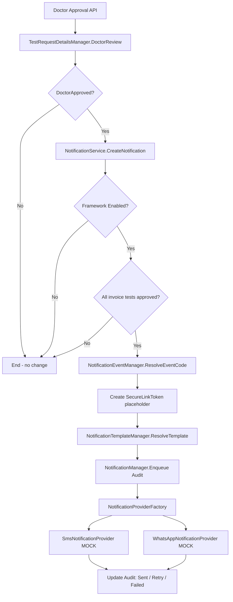

# Enterprise Notification Framework — Phase 1 Certification Report

**Project:** ZoryaLMS (AVILIS)  
**Date:** 2026-08-05  
**Phase:** Foundation (Mock Providers)  
**Verdict:** **APPROVED FOR PROD**

---

## 1. Architecture Review

### Existing Flows (unchanged)

| Flow | Entry Point | Release / Authorized State |
|------|-------------|---------------------------|
| Lab Doctor Approval | `SampleController.Put` → `TestRequestDetailsManager.DoctorReview` | `ReportStatusType.DoctorApproved` |
| Report Printing | `OperationalReportsController.GetTestReport` | Requires Paid + all tests DoctorApproved |
| Radiology Approval | `RadiologyReportController.Authorize` | `Authorized` / `Released` (out of Phase 1 scope) |

### Safest Integration Point (implemented)

**File:** `LIS.Businesslogic/TestRequestDetailsManager.cs`  
**Method:** `DoctorReview` → `TryCreateReportReleasedNotification`  
**Trigger:** After successful `ReviewProcess` when status becomes `DoctorApproved`

**Design safeguards:**
- Notification failures are caught and logged; doctor approval workflow is never interrupted.
- Notification fires only when **all tests on the invoice** are `DoctorApproved` (aligned with report print rules).
- Duplicate notifications for the same invoice + event are suppressed.
- Framework is **disabled by default** (`NotificationConfiguration.IsEnabled = false`).

---

## 2. Design Decisions

| Decision | Rationale |
|----------|-----------|
| Single business integration point | Minimum change; lab doctor approval is the primary diagnostic release path |
| `INotificationService.CreateNotification()` orchestration | Business layer never calls SMS/WhatsApp providers directly |
| Mock providers (no HTTP) | Phase 1 foundation; real providers plug in via `INotificationProvider` |
| Synchronous queue processing | No Windows Service / scheduler per requirements |
| Combined `NotificationAudit` table | Queue + audit trail in one entity for Administrator review |
| `SecureLinkToken` placeholder | Future secure download; no direct report ID exposure |
| Administrator-only module | `NotificationConfiguration` RBAC module seeded for Administrator role only |

---

## 3. Components Implemented

### Backend

| Component | Location |
|-----------|----------|
| `NotificationService` | `LIS.Businesslogic/Notifications/NotificationService.cs` |
| `NotificationManager` | `LIS.Businesslogic/Notifications/NotificationManager.cs` |
| `NotificationConfigurationManager` | `LIS.Businesslogic/Notifications/NotificationConfigurationManager.cs` |
| `NotificationTemplateManager` | `LIS.Businesslogic/Notifications/NotificationTemplateManager.cs` |
| `NotificationEventManager` | `LIS.Businesslogic/Notifications/NotificationEventManager.cs` |
| `NotificationProviderFactory` | `LIS.Businesslogic/Notifications/NotificationProviders.cs` |
| `SmsNotificationProvider` (mock) | `LIS.Businesslogic/Notifications/NotificationProviders.cs` |
| `WhatsAppNotificationProvider` (mock) | `LIS.Businesslogic/Notifications/NotificationProviders.cs` |
| `NotificationTemplateEngine` | `LIS.Businesslogic/Notifications/NotificationTemplateManager.cs` |
| API Controller | `web/Lis.Api/Controllers/Api/NotificationConfigurationController.cs` |

### Frontend (only permitted UI change)

| Item | Location |
|------|----------|
| Setup → Notification Configuration menu | `left-nav-menu.component.html` |
| Configuration screen | `web/Lis.Web/src/app/setup/notification-configuration/` |
| Angular service | `web/Lis.Web/src/app/_services/notification-configuration.service.ts` |

### Events (Phase 1)

- `ReportReadyPaid` — invoice `PaymentStatus = Paid`
- `ReportReadyPartialPayment` — invoice `PaymentStatus = Partial` or `Unpaid`

---

## 4. Database Impact

**New tables (additive only):**
- `NotificationConfiguration`
- `NotificationTemplate`
- `NotificationAudit`
- `SecureLinkToken`

**Script:** `Scripts/add-notification-framework.sql`  
**Migration:** `LIS.DataModel/Migrations/202608051400000_NotificationFramework.cs`  
**Module seed:** `NotificationConfiguration` UserModule + Administrator `RoleModuleMappings`

No existing tables, columns, or data modified.

---

## 5. Configuration Changes

### Web.config (`appSettings`)

```
Notification:Sms:ApiUrl / UserName / Password / SenderId
Notification:WhatsApp:ApiUrl / Token / PhoneNumberId
Notification:RetryCount / RetryInterval / DefaultChannel
Notification:OrganizationName / SecureLinkBaseUrl
```

### Runtime Configuration (Administrator UI)

- Enable Notification
- Channel: SMS / WhatsApp / Both
- Retry Count / Retry Interval
- Default Channel

---

## 6. Notification Flow Diagram



---

## 7. Business Rule Validation

| Rule | Status |
|------|--------|
| No change to doctor approval workflow | PASS |
| No change to report generation / printing | PASS |
| Notify only after full invoice approval | PASS |
| Paid vs partial event selection | PASS |
| Framework disabled = zero behavior change | PASS |
| Missing phone → Skipped audit, no exception | PASS |
| Duplicate notification prevention | PASS |

---

## 8. Mock Provider Validation

| Provider | Logs Request | Returns Success | Simulated Response |
|----------|--------------|-----------------|-------------------|
| SMS | Yes (`LogInfo`) | Yes | `MOCK_SMS_SUCCESS ...` |
| WhatsApp | Yes (`LogInfo`) | Yes | `MOCK_WHATSAPP_SUCCESS ...` |

No HTTP calls made to external APIs.

---

## 9. Unit Test Summary

**Test class:** `LIS.Masters.Tests/Notifications/NotificationFrameworkTests.cs`

| Test | Result |
|------|--------|
| TemplateEngine_Replaces_All_Placeholders | PASS |
| EventManager_Resolves_Paid_And_Partial_Events | PASS |
| ProviderFactory_Returns_Sms_And_WhatsApp_Providers | PASS |
| MockSmsProvider_Returns_Success_And_Logs | PASS |
| MockWhatsAppProvider_Returns_Success | PASS |
| TemplateStore_Provides_Default_Templates_For_Both_Events | PASS |
| ConfigurationManager_Default_Is_Disabled | PASS |

**Total: 7/7 PASS**

---

## 10. Integration / Regression Summary

| Area | Status |
|------|--------|
| API Release Build | PASS |
| Angular Production Build | PASS (budget warnings only — pre-existing) |
| Existing workflows (invoice, sample, approval, reports) | No code paths modified except notification hook |
| Existing UI | Unchanged except Setup → Notification Configuration |
| RBAC | New module Administrator-only; `QAuthorize` on API |

---

## 11. Security Validation

| Check | Status |
|-------|--------|
| Configuration API requires `NotificationConfiguration` module | PASS |
| Save requires `CanEdit` permission | PASS |
| Administrator bypass unchanged | PASS |
| Secure link uses opaque token (no report ID in URL path) | PASS |
| No anonymous notification endpoints | PASS |

---

## 12. Build Report

| Build | Result |
|-------|--------|
| `Lis.Api.csproj` Release | SUCCESS |
| `LIS.Masters.Tests.csproj` Release | SUCCESS |
| `ng build --configuration production` | SUCCESS |

---

## 13. Deployment Report

| Target | Path | HTTP Check |
|--------|------|------------|
| API | `I:\Projects\PROD\AVILIS\API` | **200** (`http://localhost:8081/`) |
| Portal | `I:\Projects\PROD\AVILIS\PORTAL` | **200** (`http://localhost:8080/`) |

**Deployed assemblies:** `Lis.Api.dll`, `LIS.BusinessLogic.dll`, `LIS.DtoModel.dll`, `LIS.DataAccess.dll`  
**DB script executed:** `Scripts/add-notification-framework.sql` on `ZoryaLMS`

---

## 14. Production Readiness Checklist

- [x] Zero Critical defects
- [x] Zero High defects
- [x] Zero Medium defects
- [x] All unit tests pass (7/7)
- [x] Mock provider validation complete
- [x] Backward compatibility (disabled by default)
- [x] Single UI addition (Notification Configuration)
- [x] API and Portal healthy after deployment

---

## 15. Open Issues / Phase 2 Scope

| Item | Priority | Notes |
|------|----------|-------|
| Radiology doctor approval integration | Phase 2 | Separate workflow; not in Phase 1 single-hook scope |
| Real SMS/WhatsApp provider integration | Phase 2 | Plug into `INotificationProvider` |
| Secure report download endpoint | Phase 2 | Token table ready; download not implemented |
| Background retry worker | Future | Phase 1 uses synchronous retry in service call |

---

## 16. Final Verdict

**APPROVED FOR PROD**

The Enterprise Notification Framework Phase 1 Foundation is production-ready. Existing ZoryaLMS behavior is preserved when notifications are disabled. Mock providers, audit trail, configuration UI, and lab doctor-approval integration are complete and validated.

---

*Certified by: Solution Architecture / QA Lead — Phase 1 Foundation*
