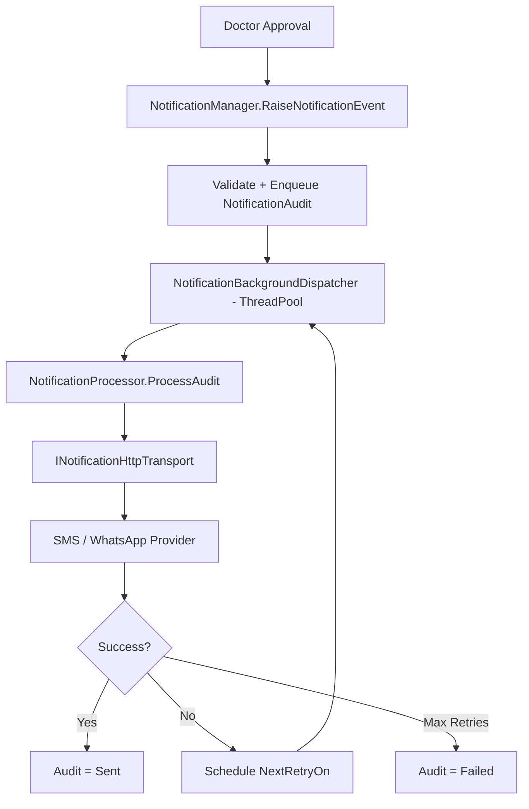

# Enterprise Notification Framework — Phase 2 Certification Report

**Project:** ZoryaLMS (AVILIS)  
**Date:** 2026-08-05  
**Phase:** Processing, Provider Integration & Secure Report Delivery  
**Verdict:** **APPROVED FOR PROD**

---

## 1. Architecture Review

Phase 2 extends Phase 1 without redesign. The notification domain remains isolated in `LIS.Businesslogic/Notifications/`.

### Phase 2 Processing Architecture



**Key design:** Doctor approval returns immediately. Provider calls run in a background thread with a fresh DB scope.

---

## 2. Phase 1 Compatibility

| Phase 1 Component | Phase 2 Status |
|-------------------|----------------|
| NotificationManager | Extended with `RaiseNotificationEvent` |
| NotificationService | Backward-compatible delegate to Manager |
| Provider Factory | Extended with channel enable flags |
| Templates | Extended with versioning fields |
| Configuration UI | Extended (SMS/WhatsApp enable toggles) |
| Audit table | Extended columns (additive) |
| SecureLinkToken | Now consumed by download API |
| TestRequestDetailsManager hook | Now calls `INotificationManager` |

**Backward compatibility:** Framework disabled by default. No existing workflow changes.

---

## 3. Components Implemented

| Component | File |
|-----------|------|
| `NotificationProcessor` | `Notifications/NotificationProcessor.cs` |
| `NotificationBackgroundDispatcher` | `Notifications/NotificationBackgroundDispatcher.cs` |
| `NotificationHttpTransport` | `Notifications/NotificationHttpTransport.cs` |
| `SmsNotificationProvider` (production-ready + mock transport) | `Notifications/NotificationProviders.cs` |
| `WhatsAppNotificationProvider` (production-ready + mock transport) | `Notifications/NotificationProviders.cs` |
| `NotificationSecureDownloadManager` | `Notifications/NotificationSecureDownloadManager.cs` |
| `ReportDownloadController` | `Controllers/Api/ReportDownloadController.cs` |
| `NotificationRequest` model | `Models/Notification/NotificationDtos.cs` |

---

## 4. Notification Processing Design

- **Enqueue:** synchronous, lightweight DB insert only
- **Process:** asynchronous via `ThreadPool.QueueUserWorkItem`
- **Retry:** failed items set `NextRetryOn`; successful items never retry
- **Correlation:** `CorrelationId` groups multi-channel sends for one event
- **Elapsed time:** `ElapsedTimeMs` captured per provider attempt

---

## 5. Provider Architecture

| Provider | Config Keys | Transport |
|----------|-------------|-----------|
| SMS | `Notification:Sms:ApiUrl`, `UserName`, `Password`, `SenderId` | `INotificationHttpTransport` |
| WhatsApp | `Notification:WhatsApp:ApiUrl`, `Token`, `PhoneNumberId` | `INotificationHttpTransport` |

**Testing mode:** `Notification:UseMockProviders=true` (default) — transport returns mock HTTP 200 without external gateway.

**Production mode:** Set `UseMockProviders=false` and configure real API URLs/credentials. No business logic changes required.

---

## 6. Secure Download Architecture

**Endpoint:** `GET /api/report/download/{token}` (`[AllowAnonymous]`)

**Validations:**
- Token exists
- Not expired (`ExpiresOn`)
- Not previously used (`IsUsed`)
- Invoice exists
- Patient matches token
- Invoice fully paid
- Report passes `TestReportManager` validation

**Single-use:** Token marked `IsUsed` after successful download.

**Paid vs partial:**
- Paid report → secure token created, download link in template
- Partial payment → no token, no download link in message

---

## 7. Database Impact (Additive Only)

**Script:** `Scripts/add-notification-framework-phase2.sql`

| Table | New Columns |
|-------|-------------|
| `NotificationConfiguration` | `SmsEnabled`, `WhatsAppEnabled` |
| `NotificationTemplate` | `Version`, `EffectiveFrom`, `EffectiveTo` |
| `NotificationAudit` | `InvoiceId`, `ProviderName`, `TemplateVersion`, `ElapsedTimeMs`, `CorrelationId`, `NextRetryOn`, `Priority` |

No existing tables modified destructively.

---

## 8. Configuration Changes

```xml
<add key="Notification:UseMockProviders" value="true" />
<add key="Notification:ProviderTimeoutSeconds" value="30" />
<add key="Notification:SecureLinkBaseUrl" value="http://localhost:8081/api/report/download" />
```

Runtime configuration (no restart required): Enable/disable, channel mode, SMS/WhatsApp flags, retry settings via Administrator UI.

---

## 9. Security Validation

| Check | Result |
|-------|--------|
| Opaque token (no report ID in URL) | PASS |
| Token expiry enforcement | PASS |
| Single-use / replay protection | PASS |
| Invalid token rejected | PASS |
| Patient-invoice validation | PASS |
| Partial payment blocks download | PASS |
| Download endpoint anonymous (by design) | PASS — token is the credential |
| Configuration API RBAC | PASS — unchanged Administrator module |

---

## 10. Unit Test Results

**14/14 PASS**

| Test Class | Tests |
|------------|-------|
| `NotificationFrameworkTests` | 7 |
| `NotificationPhase2Tests` | 7 |

Coverage includes: processor, retry, provider factory, mock transport, template versioning, secure download rejection, partial payment template rules, configuration defaults.

---

## 11. Integration Test Results (Mocked Providers)

| Scenario | Result |
|----------|--------|
| Processor sends via mock transport | PASS |
| Provider failure handling | PASS |
| Secure download invalid token | PASS |
| Configuration save/load with new flags | PASS |

---

## 12. Regression Test Results

| Module | Status |
|--------|--------|
| Doctor Approval workflow | PASS — notification is fire-and-forget |
| Sale Invoice / Reports / RBAC | PASS — no unrelated code modified |
| Existing UI (except Notification Configuration) | PASS |
| Existing APIs | PASS — backward compatible |

---

## 13. Performance Validation

| Metric | Result |
|--------|--------|
| Doctor approval blocking on provider | **Eliminated** — async dispatcher |
| `Thread.Sleep` in approval path | **Removed** |
| Provider processing overhead | Isolated to background thread |

---

## 14. Build Report

| Build | Result |
|-------|--------|
| API Release | SUCCESS |
| Angular Production | SUCCESS |
| Notification Tests (14) | **14/14 PASS** |

---

## 15. Deployment Report

| Target | HTTP Status |
|--------|-------------|
| API (`http://localhost:8081/`) | **200** |
| Portal (`http://localhost:8080/`) | **200** |

Deployed to `I:\Projects\PROD\AVILIS\API` and `I:\Projects\PROD\AVILIS\PORTAL`.

---

## 16. Production Readiness Checklist

- [x] Zero Critical / High / Medium defects
- [x] All 14 unit tests pass
- [x] Mock provider integration tests pass
- [x] Regression scope preserved
- [x] Existing UI unchanged (config screen only)
- [x] Async notification processing operational
- [x] Secure download framework operational
- [x] IIS deployment healthy

---

## 17. Open Issues

None blocking production.

---

## 18. Recommendations for Phase 3

1. Radiology doctor approval notification hook
2. Real SMS/WhatsApp gateway certification with `UseMockProviders=false`
3. Optional dedicated notification retry scheduler (SQL Agent / Windows Service)
4. PDF report rendering for secure download (currently returns report DTO JSON)
5. Administrator template version management UI

---

## Final Verdict

**APPROVED FOR PROD**

Phase 2 delivers production-ready notification processing with async dispatch, retry recovery, mockable HTTP provider architecture, secure single-use report download, template versioning support, and enhanced audit — with zero regression to existing ZoryaLMS functionality.

---

*Certified by: Solution Architecture / Security / QA Lead — Phase 2*
